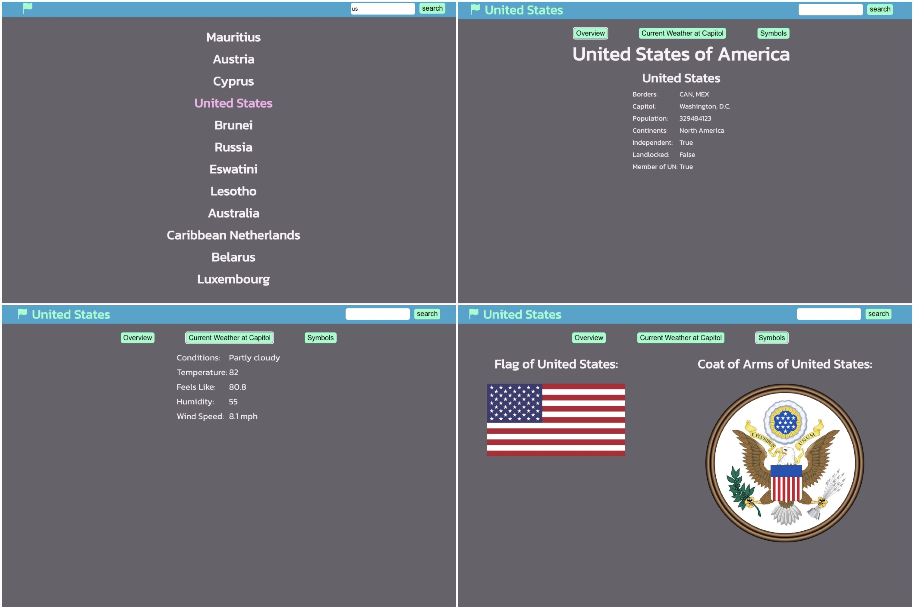

# Country Explorer

Welcome to Country Explorer, a web application that allows you to search for detailed information about any country. The app was built using React and bootstrapped with [Create React App](https://github.com/facebook/create-react-app).

## About
Country Explorer provides a user-friendly interface to explore countries and their details. The initial screen displays the search results, and upon selecting a country, you will see an overview of its details. Additionally, you can access the 'Current Weather at Capitol' and 'Symbols' tabs to explore further information.

## How to Use the App
1. Clone or download the project.
2. Navigate to the directory containing the code and run `npm install` to install all the dependencies.
3. Run `npm start` to start the app.
4. Open your browser and navigate to `http://localhost:3000` to use the app.

## API
Country Explorer utilizes the following APIs:
- Country Inforation: https://restcountries.com/
- Weather Details: https://rapidapi.com/weatherapi/api/weatherapi-com/

## Author
Laura Wu
