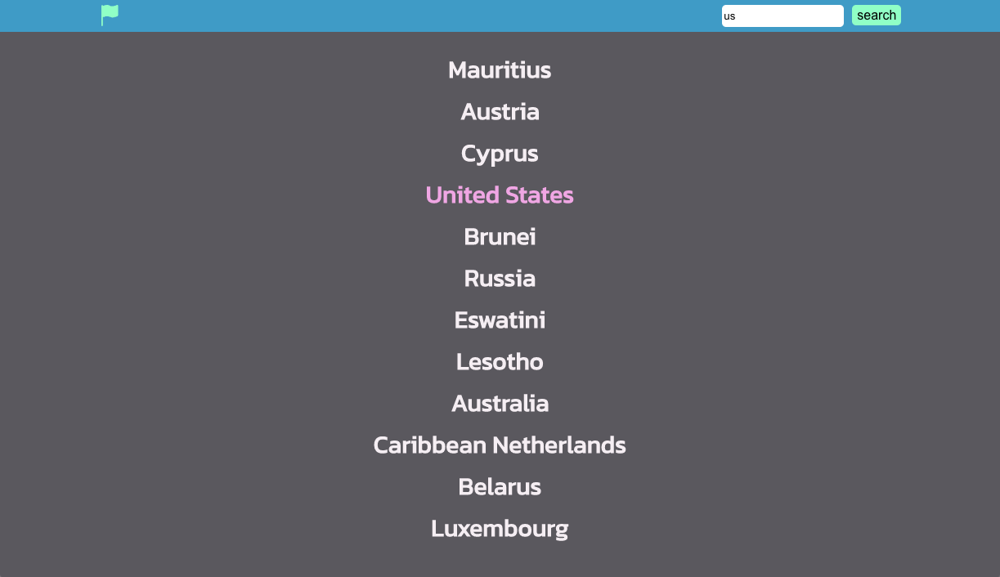
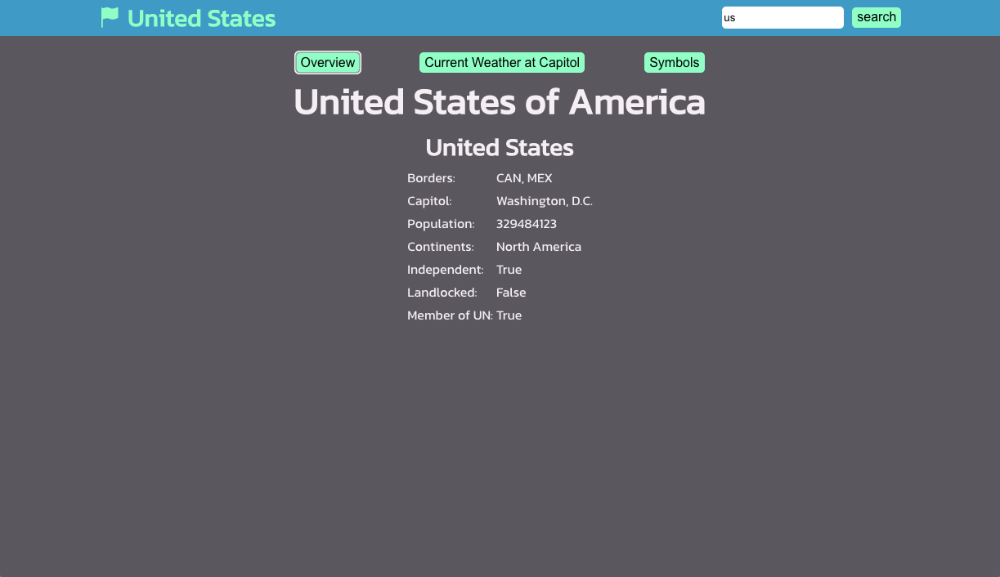
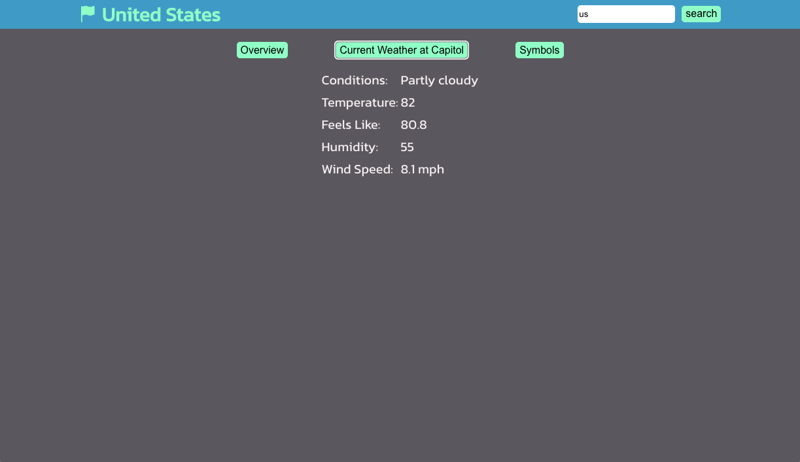
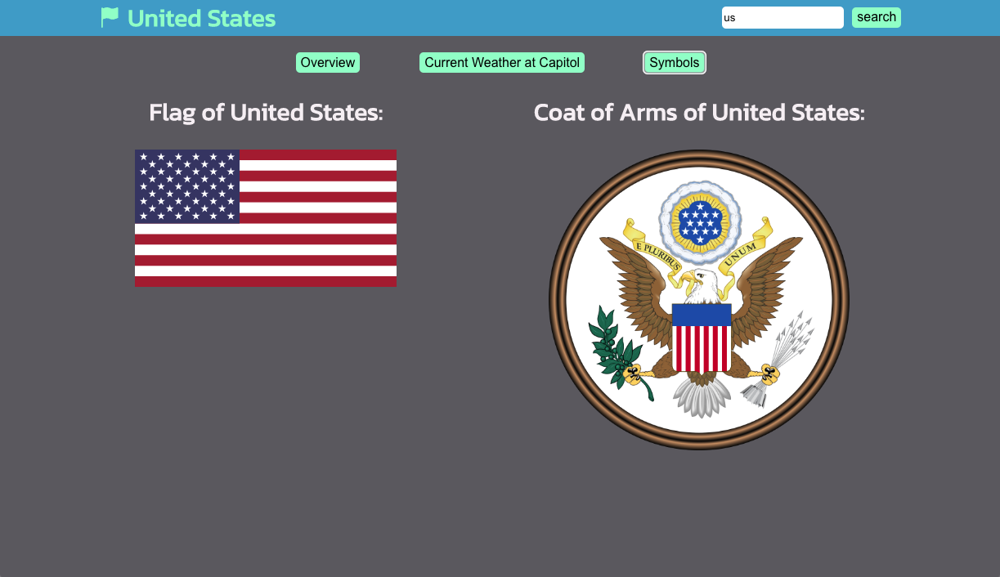

# Country Explorer

Welcome to Country Explorer where you can search for any country and view their details. The app was built using React and bootstrapped with [Create React App](https://github.com/facebook/create-react-app).

## Home and Search
Create a username and password to start posting.

## Overview
Once logged in, you can create a post and either make it public or private.

## Weather
Once a post has been submitted, you can view it in your profile. From here, you can edit the visability or delete the post.

## Symbols
If you're logged out you can still view all the public posts from the Home page.

## How to Use the App
1. Clone or download the project.
2. Navigate to the directory containing the code and run `npm install` to install all the dependencies.
3. Run `npm start` to start the app.
4. Open your browser and navigate to `http://localhost:3000` to use the app.

## API
Country Inforation: https://restcountries.com/
Weather API

## Author
Laura Wu
